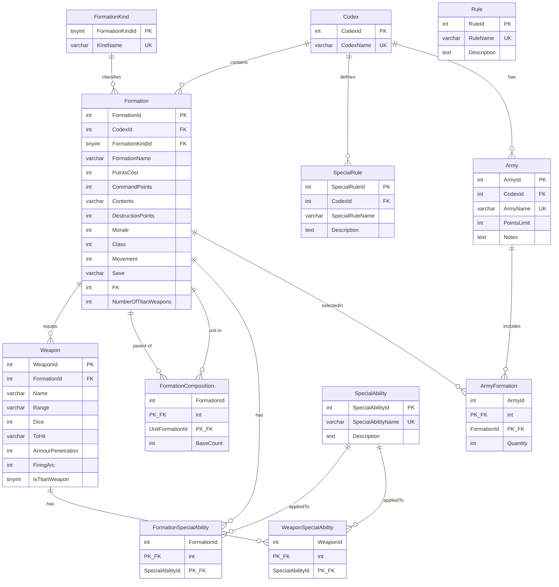

# Baguettepic database ER diagram

Entity-relationship diagram for the `baguettepic` schema defined in [`schema.sql`](./schema.sql).

Editable Mermaid source (also rendered below on GitHub):

## Entity summary

| Table | Role |
| --- | --- |
| `Codex` | Faction / army book (e.g. Tyranids) |
| `FormationKind` | Lookup for formation category (Mandatory, Company, Special, Support, Option, Limited) |
| `Formation` | Unit profile or detachment definition |
| `FormationComposition` | Which unit formations make up a detachment (`BaseCount`) |
| `Weapon` | Weapons belonging to a formation |
| `SpecialAbility` | Shared ability definitions |
| `FormationSpecialAbility` | Many-to-many: formations ↔ abilities |
| `WeaponSpecialAbility` | Many-to-many: weapons ↔ abilities |
| `SpecialRule` | Codex-scoped special rules |
| `Rule` | Standalone rules (no FK relationships yet) |
| `Army` | Player army list under a codex |
| `ArmyFormation` | Many-to-many: army ↔ formations with `Quantity` |

## Cardinality notes

- A **Codex** owns many **Formations**, **SpecialRules**, and **Armies**.
- A **Formation** may contain other formations via **FormationComposition** (self-referencing parent/unit pair).
- **SpecialAbility** is reused by both formations and weapons through junction tables.
- **Rule** is present in the schema but currently unlinked to other tables.
