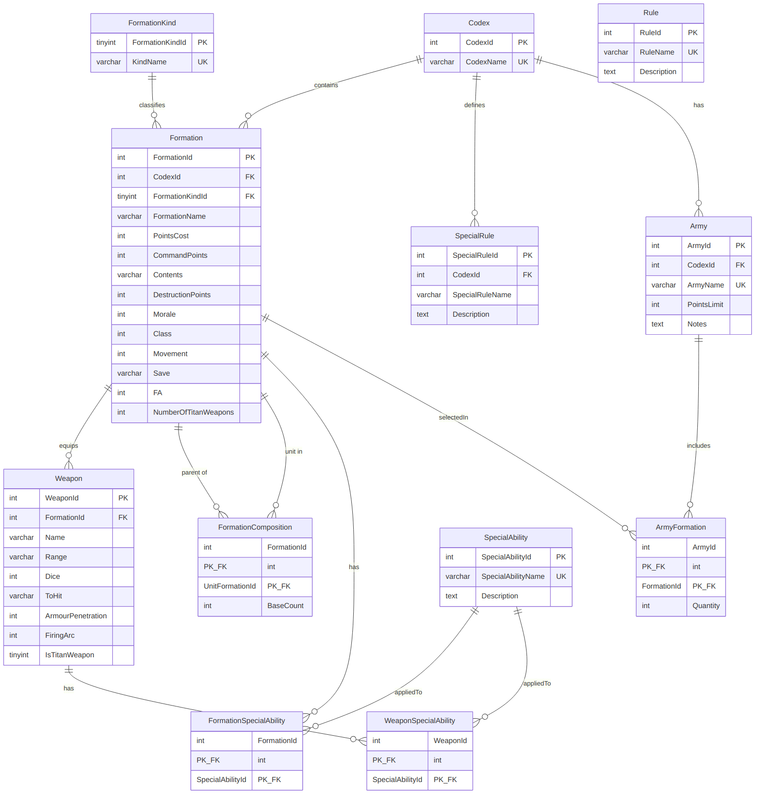
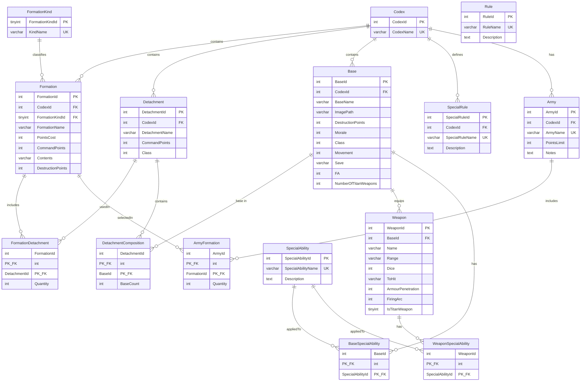

# Baguettepic database ER diagram

Entity-relationship diagram for the `baguettepic` schema defined in [`schema.sql`](./schema.sql).

Editable Mermaid source (also rendered below on GitHub):

## Entity summary

| Table | Role |
| --- | --- |
| `Codex` | Faction / army book (e.g. Tyranids) |
| `FormationKind` | Lookup for formation category (Mandatory, Company, Special, Support, Option, Limited) |
| `Formation` | Purchasable army-list card. The army builder buys these. |
| `FormationDetachment` | Which detachments a formation contains (`Quantity`) |
| `Detachment` | Table-top group of bases |
| `DetachmentComposition` | Which bases make up a detachment (`BaseCount`) |
| `Base` | Unit profile (stats, weapons, abilities, optional image path) |
| `Weapon` | Weapons belonging to a base |
| `SpecialAbility` | Shared ability definitions |
| `BaseSpecialAbility` | Many-to-many: bases ↔ abilities |
| `WeaponSpecialAbility` | Many-to-many: weapons ↔ abilities |
| `SpecialRule` | Codex-scoped special rules |
| `Rule` | Standalone rules (no FK relationships yet) |
| `Army` | Player army list under a codex |
| `ArmyFormation` | Many-to-many: army ↔ formations with `Quantity` |

## Cardinality notes

- A **Codex** owns many **Formations**, **Detachments**, **Bases**, **SpecialRules**, and **Armies**.
- An **Army** buys **Formations**. A **Formation** holds one or more **Detachments**. A **Detachment** holds one or more **Bases**.
- **SpecialAbility** is reused by both bases and weapons through junction tables.
- **Rule** is present in the schema but currently unlinked to other tables.
